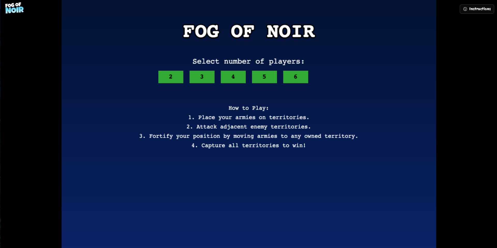
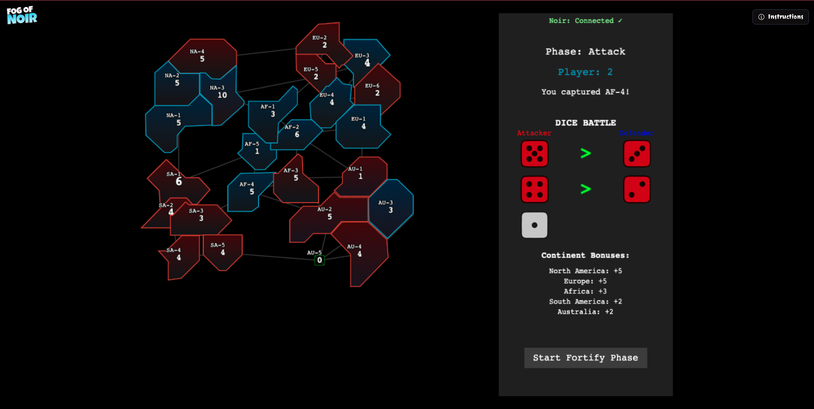
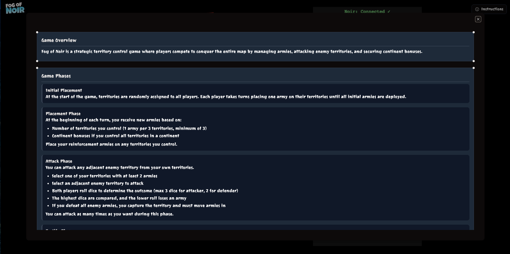
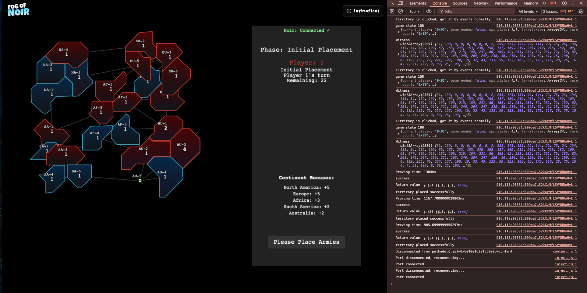

# Fog of Noir


On-chain territory conquest game built with Noir and NextJS, offering a novel approach to classic Risk-style gameplay with cryptographic privacy guarantees.

[](https://youtu.be/AV11QVYc4uU)
[](http://fog-of-noir.vercel.app/)

## 🎮 Game Overview

A strategic territory control game where players battle for map dominance through zero-knowledge circuits. Noir enables client-side proving, allowing players to generate cryptographic proofs locally that verify their moves are valid without revealing strategy. The multi-party computation (MPC) framework ensures fair gameplay while maintaining the "fog of war" element essential to strategy games without central server trust.

### Game Screenshots

<div style="display: flex; flex-wrap: wrap; gap: 10px; justify-content: center">
  
  
  
  
</div>

## How to Play

1. **Initial Placement**: Players take turns placing armies on their assigned territories
2. **Attack Phase**: Attack adjacent enemy territories using dice rolls
3. **Fortify Phase**: Redeploy troops to strengthen your position
4. **Win Condition**: Capture all territories on the map!

Supports 2-6 players with varying game dynamics based on player count.

## 🧩 Project Structure

- **Frontend**: NextJS application with PhaserJS game engine
- **Circuits**: Noir zero-knowledge circuits in the `game_circuits` folder
- **Multiplayer**: Realtime gameplay via Colyseus.js (in development)

## ⚙️ Game Circuits

The game's core logic is implemented as zero-knowledge circuits using the Noir language. These circuits handle game state transitions while maintaining player privacy.

### Core Game Circuits

The following circuits handle all game mechanics:

- `initialise_game_state`: Sets up the initial game board state
- `assign_initial_territories`: Randomly distributes territories among players
- `initialize_player_state`: Sets up a player's initial game state
- `register_all_players`: Registers all players in the game session
- `commit_to_user_secrets`: Securely stores player secrets
- `create_risk_adjacency_map`: Establishes territory connections
- `place_troops`: Allows players to place troops on territories
- `execute_attack`: Handles attack mechanics between territories
- `execute_fortify`: Allows redeployment of troops
- `end_turn`: Processes end-of-turn state changes
- `count_player_territories`: Tallies territories owned by each player
- `check_win_condition`: Determines if a player has won

### Testing

Test cases covering the full game journey for a two-player game are available in:
```
game_circuits/src/test.nr
```

Run the test suite with:
```bash
nargo test --show-output
```

### Compiling Circuits

To compile and export the circuits for use in the frontend:

```bash
nargo export
./generate_ts_bindings.sh  # Generates TypeScript bindings
```

Gate count reports for circuit complexity are available in `game_circuits/gates_report.json`.

## 🖥️ Frontend

The game frontend is built with modern web technologies:

- **NextJS**: React framework for the application
- **Tailwind CSS**: For styling components
- **PhaserJS**: Game engine for rendering and interaction
- **Radix UI**: Component library for UI elements
- **Colyseus.js**: Multiplayer functionality (in development)

### Local Development

To run the game locally:

```bash
# Install dependencies (requires Bun)
bun install

# Start development server
bun dev
```

The application will be available at `http://localhost:3000`.

## 📹 Demo Video

Watch the gameplay demonstration and learn about the technical implementation:

<a href="https://youtu.be/AV11QVYc4uU">
  
</a>

## 🔗 Dependencies

The game circuits use the MPC library for zero-knowledge computations:

```
mpclib = { tag = "main", git = "https://github.com/zac-williamson/mpclib" }
```

## 🚀 Future Roadmap

- Persistent game state using decentralized storage
- Complete multiplayer implementation with matchmaking

## 📝 Feedback & Contributions

Your feedback is valuable! Feel free to:
- Open an issue for bugs or feature requests
- Submit a pull request with improvements
- Share your thoughts and suggestions

Connect with the developer:
- Twitter: [@satyambnsal](https://x.com/satyambnsal)
- Telegram: [satyambnsal](http://t.me/satyambnsal)

Project [Slides Deck](https://docs.google.com/presentation/d/13PqGn1UZDgEwVI_esuVUOcZcPDJk3nAyoU9C0nHhdqI/edit?usp=sharing)

## 📜 License

This project is licensed under the [MIT License](LICENSE).

---

Made with ❤️ by Satyam Bansal
